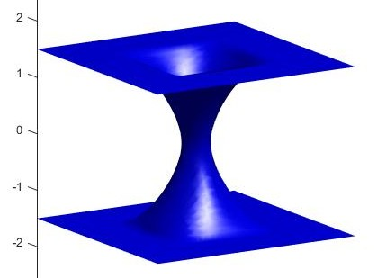
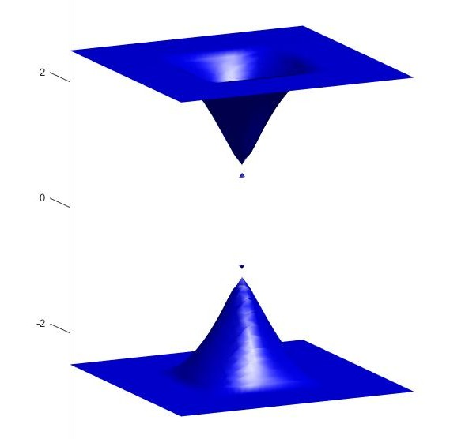

# Level Set Method for the Motion of Soap Bubble

## About this Project

This project is for simulating a soap film between two rectangular grids. This is based on a paper written by D. L. Chopp(1992), suggesting a technique for computing minimal surfaces using Level Set Method.

## Algorithm
This problem can be viewed as finding a minimal surface containing two grids. 
The algorithm as follows.
1. Set two rectangular grids in 3-dimensional space
2. Set a initial surface containing two grids.
3. Make a narrow band(tubular neighborhood) of the surface
4. Define a signed distance function in the band. This function must have zero value on the surface, positive inside the surface and negative outside the surface.
5. Calculate the curvature flow at each point in the band and update the value of the function.
6. Find a new zero level set of the function.
7. Repeat 3~6 until the function converges.

See more details on the [report](public/report_final.pdf)(written in Korean).

## How to run
Open nbm3d_final.m file on Matlab, fix some hyperparameters and run the code.(works well in Matlab R2015a)

## Result
I ran 500 iterations for each case. Sample results are as follows

  
   
  <b>Case 1. width=2, height=2, distance=2</b> 

  
   
  <b>Case 2. width=2, height=2, distance=3</b> 

  
   
  <b>Case 3. width=2, height=2, distance=5</b> 

## Reference
[1] D. L. Chopp, Computing Minimal surfaces via level set curvature flow, Journal of computational physics 106 (1993), 77-91. 
[2] J. A. Sethian, Fast marching methods and level set methods for propagating interfaces, von Karman institute lecture series (1998). 
